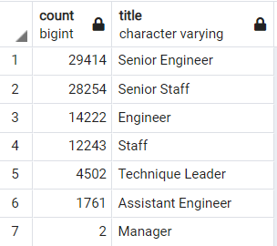
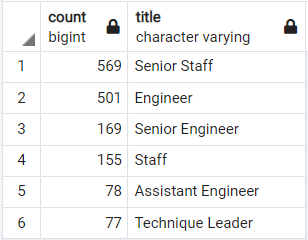
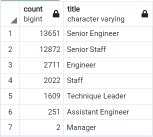
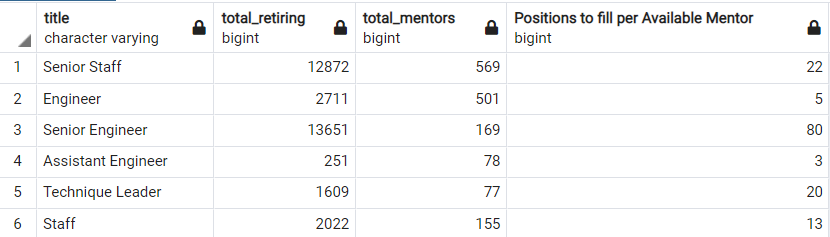

# Pewlett-Hackard-Analysis
## Overview
The purpose of this analysis is to assist Pewlett-Hackard in future proofing itself by sorting and organizing its employee database, seeing who is eligible for retirement and qualify for the retirement package, and how many positions (and when) will need to be filled once the current employees retire.

### Results
There is a significant portion of the company that is saying their fair wells. Compliling a full list of employees, we find a few notable points:
* A vast majority of employees eligible for retirement are senior engineers and senior staff, with a total of 57,668 total number of employees leaving.
* Only two managers are eligible for retirement.
* Compared to the huge number leaving, only a small percentage of these employees are eligible for the mentorship program
* Where 57,668 are leaving from just two positon tiers, there is a total of 1,380 employees that qualify for the mentorship program overall

(For reference, the left table displays total retiring employees and the right table displays how many qualify for the mentorship program, by position title)

There is a clear problem here. Looking over our queries, we find that we are capturing all employees, past AND current. We should not be counting employees who have already retired as part of this new initiative, and after some simple refactoring and relocating where we obtain our data, mainly changing our data source from all employees to current ones (thankfully we created a table for this much earlier), we find a significant drop of retirees, from 90,398 to 33,118.

Although this means there will still be many positions to fill in the future, now our numbers seem much less daunting. Our findings from before still hold true however, with the exception of the total number of employees leaving Pewlett-Hackard as senior engineers and senior staff (Amounting to a new total of 26,523 between the two position tiers)

#### Summary
As this analysis is to prepare Pewlett-Hackard for the "silver tsunami", we have come to our final numbers in preparation for the future, and answers to two posed questions.

##### How many roles will need to be filled as the "silver tsunami" begins to make an impact?
After refactoring our initial queries, we total out to requiring to fill 33,118 positions as employees begin retiring. Much better than the initial 90,398. As for which positions they are to fill, we have filtered the outgoing employees by title, as seen in the following table:

##### Are there enough qualified, retirement-ready employees in the departments to mentor the next generation of Pewlett Hackard employees?
This is a more complicated question to answer, and truly depends on those who are eligible for the mentorship program. Statically, refering to the number of positions in each position title required filling vs number of mentors available on hand per position level, we would be refering to the table below:

However, the mentors themselves may or may not be able to handle overseeing training for all the new employees. For example, mentors for assistant engineers have quite an easy time, as each mentor only needs to oversee 3 new employees at that position tier. On the other hand, each senior engineer mentor will have 80 people to deal with. That said, not every employee who qualified for the mentorship program is suited for it. On the individual level, 3 new employees might be too much for a mentor at the assistant engineer level, and this is just a small example. Taking a sort of classroom approach, each mentor should be able to oversee those filling new positions, while additional people will need to be brought in to properly oversee the number of senior engineer positions, and make sure that they are properly trained.

